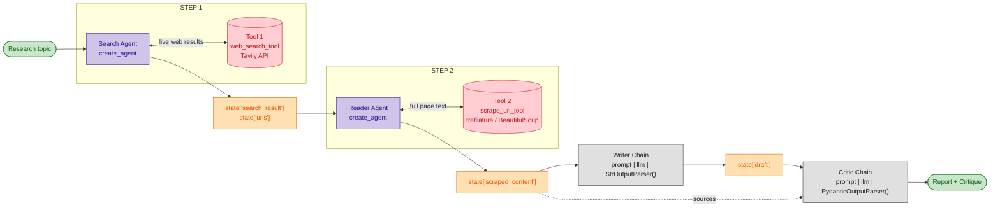

# Multi-Agents-System

A multi-agent research system. You give it a topic; it searches the live web, reads
the pages it finds, writes a grounded report, and then grades that report against the
sources it came from.

Built on LangChain v1 (`create_agent`), Tavily for search, and trafilatura +
BeautifulSoup for content extraction.

---

## Architecture



| Colour | Meaning |
|---|---|
| 🟩 Green | Input / output |
| 🟪 Purple | Autonomous agent (decides its own tool calls) |
| 🟥 Red | External tool |
| 🟧 Orange | Workflow state |
| ⬜ Grey | Processing chain (single pass, no tools) |

### Why agents *and* chains

The first two steps are **agents**: they decide how many searches to run, which urls
are worth reading, and what to do when a page fails. That judgement is the work.

The last two are **chains**: one pass, no tools, no loop. Writing a report from fixed
source material and grading it are deterministic transforms — an agent loop there
would add cost and latency for nothing.

---

## The flow, step by step

**1. Search agent** — receives the topic, calls `web_search_tool` one or more times
with varied phrasings, and returns a shortlist of urls. Only the url and a
300-character snippet are kept per hit; the snippet exists to let the agent *choose*,
not to answer from.

**2. Reader agent** — receives those urls and calls `scrape_url_tool` on each. Pages
that fail return an `error` field instead of raising, so the agent notes the failure
and moves to the next url.

**3. Writer chain** — receives topic + scraped text and produces the report. The
system prompt forbids adding anything the sources do not support and requires it to
state coverage gaps plainly rather than filling them from model knowledge.

**4. Critic chain** — receives topic + draft + the same sources, and returns a
validated `Critique` object:

```python
class Critique(BaseModel):
    score: int          # 1-10
    strengths: list[str]
    improvements: list[str]
    verdict: str        # one line
```

### Workflow state

One dict flows through all four stages, each writing its own slot:

| Key | Written by | Contents |
|---|---|---|
| `topic` | caller | The research question |
| `search_result` | step 1 | Deduped hits — `[{url, content}]` |
| `search_notes` | step 1 | Search agent's closing message |
| `urls` | step 1 | Shortlisted urls, capped at `MAX_URLS` |
| `scraped_content` | step 2 | `[{url, title, author, published, content, word_count, extracted_with}]` |
| `reading_notes` | step 2 | Reader agent's inventory |
| `sources` | step 3 | Formatted source block given to writer and critic |
| `draft` | step 3 | The report |
| `critique` | step 4 | `Critique` instance |

State comes from the **tool** output, not the agents' prose — tool returns are already
structured, so nothing is re-parsed out of natural language. Shortlisted urls are
cross-checked against what the tool actually returned, so a hallucinated url can never
reach the scraper.

---

## Setup

```bash
git clone https://github.com/<you>/Multi-Agents-System.git
cd Multi-Agents-System

python -m venv .venv
.venv\Scripts\activate          # Windows
# source .venv/bin/activate     # macOS / Linux

pip install -r requirements.txt

cp .env.example .env            # then add your keys
```

`.env`:

```
OPENAI_API_KEY=sk-proj-...
TAVILY_API_KEY=tvly-...
GEMINI_API_KEY=
LLM_PROVIDER=openai
```

Keys: [OpenAI](https://platform.openai.com/api-keys) · [Tavily](https://app.tavily.com)

---

## Usage

```bash
python main.py "how do vector databases handle hybrid search"
```

Each stage prints as it completes, so you can watch the flow:

```
====== STEP 1 - SEARCH AGENT ======
topic: how do vector databases handle hybrid search
12 results found:
  - https://...
    Hybrid search combines dense vector similarity with...
selected 4 to read:
  -> https://...

====== STEP 2 - READER AGENT ======
  [ok]    1169 words  Hybrid Search Explained
          https://...  (trafilatura)
  [fail]  https://...
          HTTPError: 403 Client Error

====== STEP 3 - WRITER CHAIN ======
<full report>
(716 words)

====== STEP 4 - CRITIC CHAIN ======
score: 9/10
strengths:
  + ...
improvements:
  - ...
verdict: ...
```

### As a library

```python
from pipeline import ResearchPipeline

state = ResearchPipeline(verbose=False).run("your topic")

print(state["draft"])
print(state["critique"].score, state["critique"].verdict)
```

`verbose=False` suppresses the trace; the work and the returned state are identical.

Stages can also be driven individually — useful for inspecting or overriding a step:

```python
pipeline = ResearchPipeline()
state = {"topic": "your topic"}

pipeline.search(state)
state["urls"] = ["https://a-url-you-picked-yourself.com"]   # override
pipeline.read(state)
pipeline.write(state)
pipeline.critique(state)
```

---

## Project structure

```
Multi-Agents-System/
├── main.py                 CLI entry point
├── config.py               Model factory + every tunable
├── requirements.txt
├── .env.example
│
├── tool/
│   └── tool.py             web_search_tool, scrape_url_tool, to_documents
│
├── agent/
│   ├── agent.py            build_search_agent, build_reader_agent
│   └── chain.py            build_writer_chain, build_critic_chain, Critique
│
└── pipeline/
    └── pipeline.py         ResearchPipeline
```

`agent/` and `tool/` only **build** things. All invocation, state threading, and
printing lives in `pipeline/` — one place owns orchestration, so agents stay reusable
and independently swappable.

---

## Configuration

Everything tunable is in `config.py`:

| Setting | Default | Effect |
|---|---|---|
| `PROVIDER` | `openai` | `openai` or `gemini`, from `LLM_PROVIDER` |
| `OPENAI_MODEL` | `gpt-4o-mini` | Model for every agent and chain |
| `MAX_RESULTS` | `5` | Tavily hits per search call |
| `SNIPPET_CHARS` | `300` | Snippet kept per search hit |
| `MAX_CONTENT_CHARS` | `8000` | Cap per scraped page |
| `MAX_URLS` | `4` | Pages the reader agent scrapes |
| `SOURCE_CHARS` | `4000` | Cap per source in the writer prompt |
| `REQUEST_TIMEOUT` | `20` | Scrape timeout, seconds |

`MAX_CONTENT_CHARS` and `SOURCE_CHARS` are two separate gates, so `MAX_URLS` sources
can never blow the context window.

Switch to Gemini by setting `LLM_PROVIDER=gemini` and `GEMINI_API_KEY` — no code change.

---

## Extending

**Add a tool** — write a `@tool` function in `tool/tool.py` and pass it to an agent in
`agent/agent.py`. The decorator builds the schema from your type hints and the
description from your docstring, so write the docstring for the model: it decides when
to call the tool and how to react to failure based on that text.

**Add an agent or chain** — export a `build_*()` factory from `agent/`, then wire it
into `pipeline.py` as a new stage that reads and writes `state`.

**Revision loop** — the critic returns a numeric `score`, so a re-write loop is a
small addition to `run()`:

```python
if state["critique"].score < 7:
    state["draft"] = self.writer_chain.invoke({
        "topic": state["topic"],
        "sources": state["sources"] + f"\n\nEditor feedback:\n{state['critique'].improvements}",
    })
```

---

## Notes

- Tools never raise. Failures return the normal shape with an `error` field, so one
  dead link cannot kill a run.
- The pipeline does raise in exactly one place: if *every* page fails to scrape.
  Without that guard the writer would produce a confident, unsourced report — the
  precise failure this design exists to prevent.
- `scrape_url_tool` tries trafilatura first (built to strip boilerplate) and falls
  back to BeautifulSoup only when it returns nothing.
- `to_documents()` converts scraped pages into LangChain `Document` objects if you
  want to add a vector store or retriever later.
